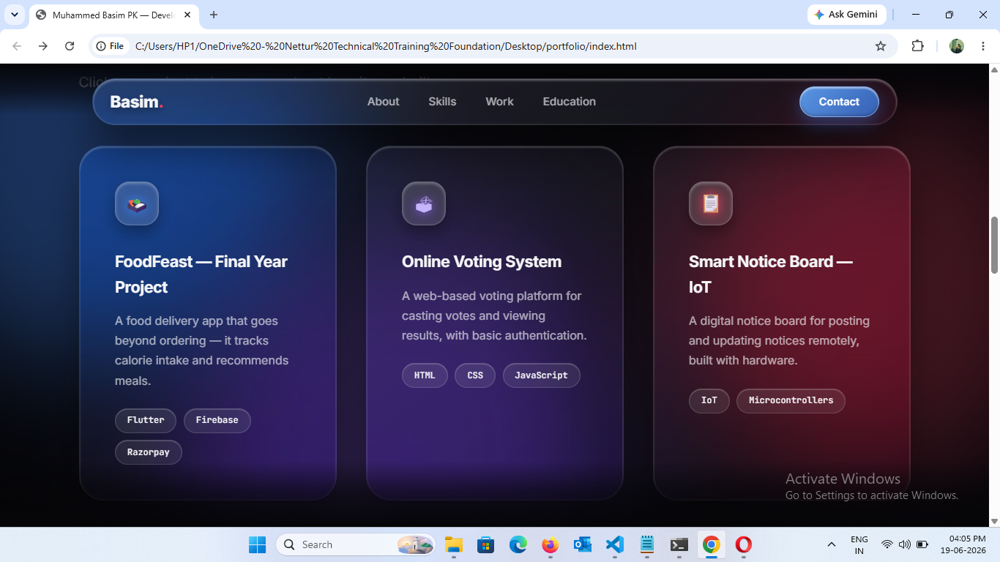
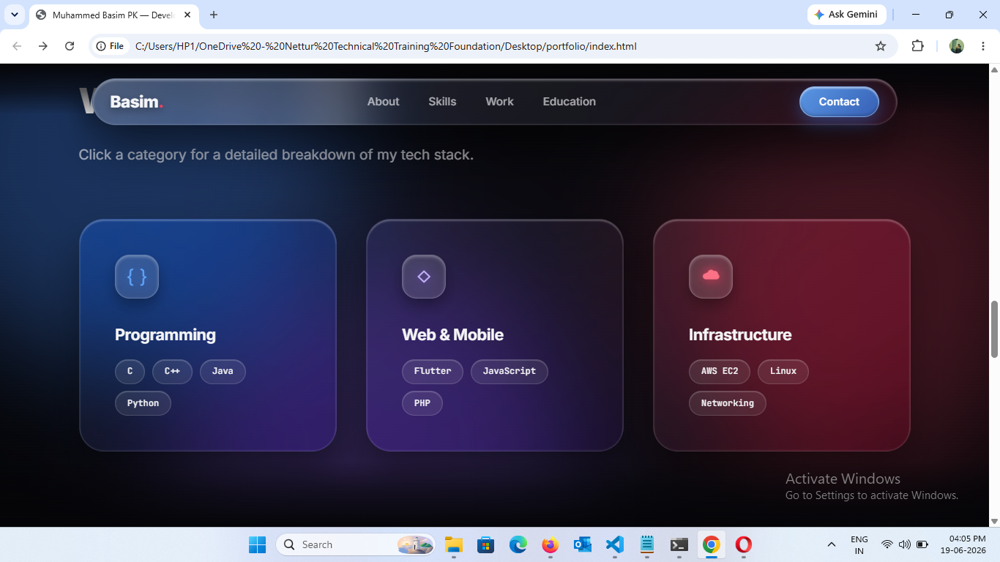
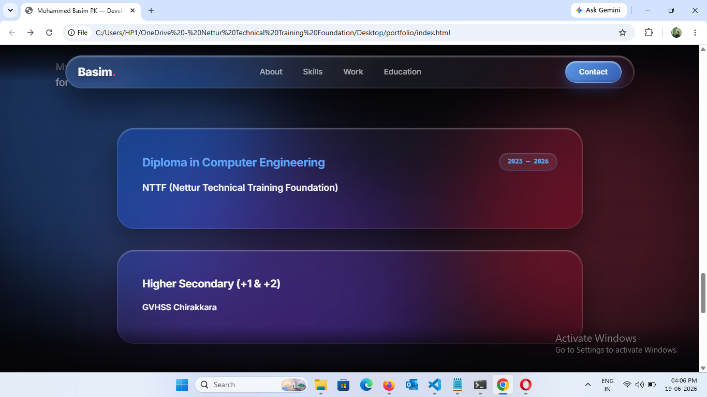
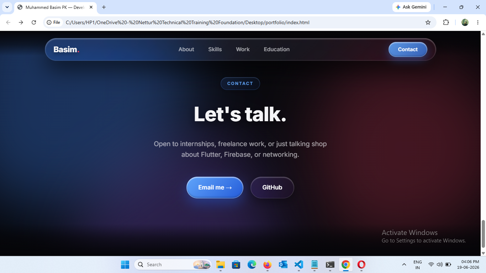
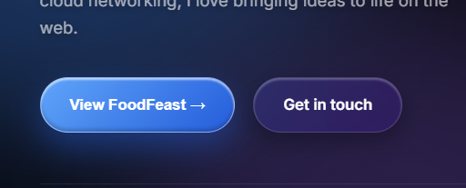

# Muhammed Basim PK — Developer Portfolio

A single-page animated portfolio website built with vanilla HTML, CSS, and JavaScript — featuring a liquid-glass design language, an interactive phone carousel, and motion-driven UI elements.

🔗 **Live file:** `index.html`
📧 **Contact:** muhammedbasimpk73@gmail.com
💻 **GitHub:** [github.com/Basimpk031](https://github.com/Basimpk031)

---

## 🖼️ Preview

| Work Section | Skills Section |
|---|---|
|  |  |

| Education Section | Contact Section |
|---|---|
|  |  |

<sub>Animated call-to-action buttons on the hero section:</sub>



---

## 👋 About Me

I'm **Muhammed Basim PK**, a web developer and IT Infrastructure student from Kerala, India, currently completing my final year diploma in Bangalore. I'm passionate about building clean, responsive, and interactive digital experiences — from mobile apps to web interfaces to networking fundamentals.

I'm open to **internships, freelance work**, or just talking shop about Flutter, Firebase, or networking.

### 🎓 Education

| Qualification | Institution | Duration |
|---|---|---|
| Diploma in Computer Engineering & IT Infrastructure | NTTF (Nettur Technical Training Foundation) — Thalassery, Kerala → Bangalore (Electronic City) | 2023 – 2026 |
| Higher Secondary (+1 & +2), Computer Science | GVHSS Chirakkara | — |

### 🏅 Certifications
- CCNA (in progress)

---

## 🛠️ Skills

**Programming**
`C` · `C++` · `Java` · `Python`

**Web & Mobile**
`Flutter` · `JavaScript` · `HTML/CSS` · `PHP`

**Infrastructure**
`AWS EC2` · `Linux` · `Networking` · `CCNA`

---

## 🚀 Featured Project — FoodFeast

My final year project: a food delivery app that goes beyond ordering — it tracks calorie intake and recommends meals based on health data.

- **Frontend:** Fully functional Flutter mobile app
- **Backend:** Firebase Auth, Firestore database, real-time live order tracking
- **Payments:** Integrated Razorpay gateway (including saved-card flow)
- **AI Insights:** Health-aware recommendation engine factoring in nutritional data and wellness metrics (blood sugar, blood pressure)
- **Extras:** Dynamic Island–style order tracking overlay (Android), location-based delivery radius enforcement, delivery agent dashboard with OTP confirmation flow

**Tech stack:** `Flutter` · `Firebase` · `Razorpay`

### Other Projects

| Project | Description | Stack |
|---|---|---|
| 🗳 Online Voting System | A secure web-based platform for digital elections — candidate management, vote casting, and real-time results. | HTML, CSS, JavaScript, PHP |
| 📋 Smart Notice Board | An IoT-based digital notice board that lets admins push updates wirelessly to a physical display. | IoT, Microcontrollers, C++ |

---

## 🎨 About This Website

This portfolio was designed with a **liquid-glass (glassmorphism)** aesthetic — frosted blur panels, soft ambient gradient orbs, and rim-lit borders — paired with motion design so the UI feels alive and clearly interactive.

### Key Features
- **Animated ambient background** — three blurred, slowly-morphing gradient orbs drifting behind the content
- **Phone carousel** — an auto-rotating, swipeable showcase of FoodFeast app screenshots with tap-to-cycle and tap-to-open behavior
- **Idle motion design** — buttons, cards, badges, and icons gently float/breathe/pulse at rest so they read as clickable before the user even hovers
- **Scroll-reveal animations** — section headers and project cards fade/slide into view as you scroll, staggered for a natural cascade
- **Interactive project & skill cards** — 3D tilt-on-hover (desktop) with a custom glass-glow that follows the cursor
- **Dynamic status bar color** — the mobile browser theme color subtly shifts hue over time, synced to scroll position
- **Fully responsive** — adapts to mobile with a slide-down nav menu and simplified card interactions, with `prefers-reduced-motion` respected throughout

### Built With
- Pure **HTML5 / CSS3 / vanilla JavaScript** — no frameworks
- **Google Fonts:** Inter, JetBrains Mono
- IntersectionObserver API for scroll-reveal
- CSS custom properties for theming, `backdrop-filter` for glass effects

### File Structure
```
portfolio/
├── index.html        # Single-file site (HTML + CSS + JS)
└── images/
    ├── splash.jpg     # FoodFeast onboarding screen
    ├── home.jpg       # FoodFeast home screen
    ├── tracking.jpg   # FoodFeast live tracking screen
    └── cart.jpg       # FoodFeast cart screen
```

### Running Locally
Just open `index.html` in any modern browser — no build step or server required. Make sure the `images/` folder sits alongside it with the four FoodFeast screenshots.

---

## 📬 Get In Touch

- **Email:** [muhammedbasimpk73@gmail.com](mailto:muhammedbasimpk73@gmail.com)
- **GitHub:** [github.com/Basimpk031](https://github.com/Basimpk031)
